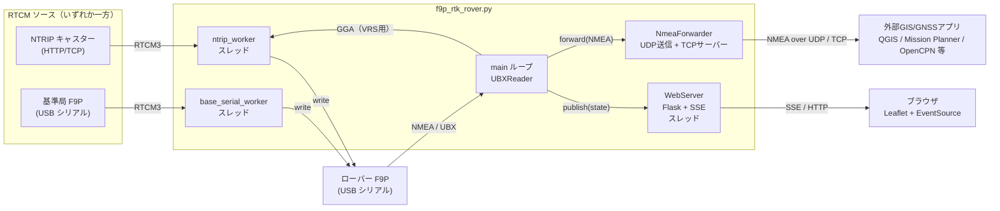

# f9p_rtk_rover

u-blox ZED-F9P をローバーとして動作させる Python クライアント。NMEA / UBX メッセージを読み取りつつ、NTRIP キャスターまたはローカル基準局 F9P から受信した RTCM3 補正データを受信機にフィードする。

## 機能

- シリアル経由で ZED-F9P の GGA / NAV-PVT を解析・表示
- GGA の Quality からフィックス状態（RTK FIXED / RTK FLOAT / DGNSS / 3D など）を判定
- RTCM3 補正データのソースを2系統サポート（排他）:
  - **NTRIPキャスター**: HTTP接続で受信、VRS対応として GGA を定期送信
  - **基準局F9Pのシリアル**: ローカル基準局から直接 RTCM3 を取り込みローバーへ転送
- RTCM ソース指定がなければローカル受信のみで動作
- 切断時の自動再接続

## システム構成



- RTCMソースは NTRIP か 基準局シリアルのいずれか一方（同時指定はエラー）。
- ローバーから受信した NMEA(GGA) は、NTRIP 利用時のみキャスターへ送り返される（VRS対応）。
- `--web` 指定時のみ WebServer スレッドが起動し、ブラウザに測位状態を SSE で配信する。
- `--nmea-udp` / `--nmea-tcp-port` 指定時のみ NmeaForwarder が起動し、ローバーの NMEA を外部GIS/GNSSアプリへ転送する。

## 動作環境

- Python 3.8 以上
- ZED-F9P など u-blox F9 系受信機（USB シリアル接続）

## インストール

```bash
pip install -r requirements.txt
```

依存ライブラリ:

- `pyserial`
- `pyubx2`
- `flask`（Web UI 利用時のみ。`--web` を指定しなければ未使用でも動作）

## 使い方

### 1. ローカルのみ（NTRIP 無効）

```bash
python f9p_rtk_rover.py --serial COM9 --baud 115200
```

### 2. NTRIP クライアントとして利用

```bash
python f9p_rtk_rover.py ^
  --serial COM9 ^
  --baud 115200 ^
  --host rtk2go.example.com ^
  --port 2101 ^
  --mountpoint MOUNT_NAME ^
  --user USERNAME ^
  --password PASSWORD
```

`--host` と `--mountpoint` の両方が指定された場合のみ NTRIP スレッドが起動する。

### 3. 基準局F9Pをシリアル直結して使う

PC に USB シリアル接続した基準局 F9P から RTCM3 を読み取り、ローバー F9P のシリアルへ転送する。NTRIP プロトコル不要。

```bash
python f9p_rtk_rover.py ^
  --serial COM9 ^
  --baud 115200 ^
  --base-serial COM10 ^
  --base-baud 115200
```

`--base-serial` は `--host` / `--mountpoint` とは排他。同時指定するとエラー終了する。基準局 F9P 側は u-center 等で base mode に設定し、UART/USB から RTCM3 が出力されている必要がある。

### 4. Web UI で測位結果をブラウザ表示

`--web` を付けると Flask + SSE による軽量Webサーバーが起動し、ブラウザでリアルタイムに測位結果（地図 + 軌跡 + ステータス）を確認できる。初回起動時に Leaflet を `static/vendor/leaflet/` に自動ダウンロードする（インターネット必要）。

```bash
python f9p_rtk_rover.py ^
  --serial COM8 ^
  --baud 230400 ^
  --base-serial COM9 ^
  --base-baud 230400 ^
  --web ^
  --web-port 8765
```

ブラウザで `http://127.0.0.1:8765/` を開くと、地図上に現在位置がプロットされ、軌跡が描画される。RTKステータスはバッジ色で識別可能（緑=FIXED / 橙=FLOAT / 青=DGNSS / 赤=NO FIX）。

| エンドポイント | 内容 |
|------|------|
| `GET /` | UI (index.html) |
| `GET /api/state` | 現在の測位スナップショット + 軌跡 (JSON) |
| `GET /api/stream` | Server-Sent Events での測位データ配信 |

### 5. 外部GIS/GNSSアプリへ NMEA を転送

ローバーから受信した NMEA を UDP / TCP で外部アプリに転送する。プロトコルは **NMEA 0183**（GIS/GNSS界の事実上の標準）なので、QGIS / Mission Planner / u-center / OpenCPN などが追加コードなしで受信できる。

#### UDP転送（複数同時可、ブロードキャスト可）

```bash
python f9p_rtk_rover.py ^
  --serial COM8 ^
  --baud 230400 ^
  --base-serial COM9 ^
  --base-baud 230400 ^
  --nmea-udp 127.0.0.1:10110 ^
  --nmea-udp 192.168.1.255:10110
```

#### TCPサーバとして配信（受信側がクライアントとして接続）

```bash
python f9p_rtk_rover.py ^
  --serial COM8 ^
  --baud 230400 ^
  --base-serial COM9 ^
  --base-baud 230400 ^
  --nmea-tcp-port 10110
```

#### 送信するセンテンスをフィルタする場合

```bash
python f9p_rtk_rover.py --serial COM8 --baud 230400 ^
  --nmea-udp 127.0.0.1:10110 ^
  --nmea-sentences GGA,RMC,VTG
```

`10110` は NMEA 用に広く使われるポート番号。受信側アプリで「NMEA over UDP/TCP」入力として上記ホスト・ポートを指定する。

## オプション

| オプション | 既定値 | 説明 |
|------------|--------|------|
| `--serial` | （必須） | ローバーF9Pのシリアルポート（例: `COM9`, `/dev/ttyACM0`） |
| `--baud` | `115200` | ローバーF9Pのボーレート |
| `--host` | `None` | NTRIP キャスターのホスト名 |
| `--port` | `2101` | NTRIP キャスターのポート |
| `--mountpoint` | `None` | マウントポイント名 |
| `--user` | `None` | NTRIP 認証ユーザー |
| `--password` | `None` | NTRIP 認証パスワード |
| `--base-serial` | `None` | 基準局F9Pのシリアルポート（NTRIPと排他） |
| `--base-baud` | `115200` | 基準局F9Pのボーレート |
| `--gga-interval` | `10.0` | GGA を NTRIP キャスターへ送る間隔（秒） |
| `--reconnect-interval` | `5.0` | 切断時の再接続待機時間（秒、NTRIP/基準局共通） |
| `--verbose` | `False` | NAV-PVT や RTCM 受信量の詳細ログを出力 |
| `--web` | `False` | Web UI サーバーを起動する |
| `--web-host` | `127.0.0.1` | Web サーバーのバインドアドレス |
| `--web-port` | `8000` | Web サーバーのポート |
| `--nmea-udp` | `None` | NMEA UDP転送先 `HOST:PORT`（複数指定可、ブロードキャスト可） |
| `--nmea-tcp-port` | `None` | NMEA配信用TCPサーバーの待受ポート |
| `--nmea-tcp-host` | `0.0.0.0` | NMEA配信用TCPサーバーのバインドアドレス |
| `--nmea-sentences` | `None` | 転送するNMEAセンテンスをカンマ区切り指定（例: `GGA,RMC`） |

## 出力例

```
reading GNSS messages...
[NTRIP] connecting...
[NTRIP] connected
ICY 200 OK
RTK FIXED | lat=35.68123600, lon=139.76712500, alt=40.0m, sats=22, hdop=0.6, RTCM=1024 bytes, age=0.2s
```

## 停止方法

`Ctrl+C` で終了。シリアルポートと NTRIP 接続はクローズされる。

## ライセンス

未指定。
